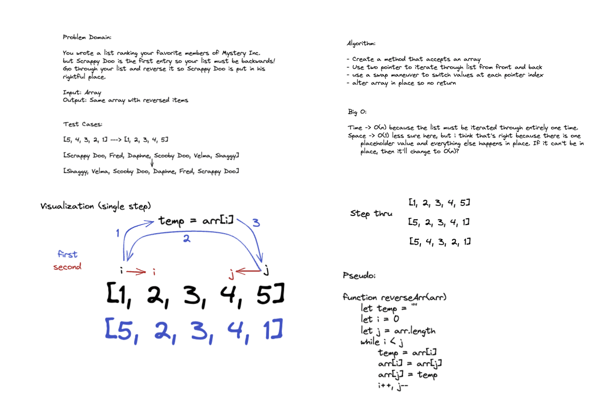

# Reverse an Array

Write a function called reverseArray which takes an array as an argument. Without utilizing any of the built-in methods available to your language, return an array with elements in reversed order.

## Whiteboard

## Approach and Big O

I used the two pointer method with a swap so that I would only have to go through the array once, swapping values along the way. I chose to alter in place to keep space usage to a minimum. As far as I know the time complexity is O(n) and space is O(1).
