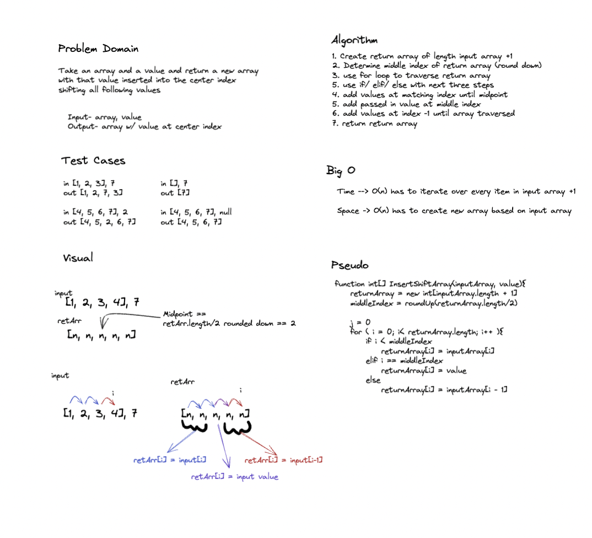

# Insert Shift Array

1:47 - 2:14 ~30 min?

## Feature Tasks

Write a function called insertShiftArray which takes in an array and a value to be added. Without utilizing any of the built-in methods available to your language, return an array with the new value added at the middle index.

## Whiteboard

## Approach and Efficiency

Used a for loop with an if tree. For loop because I needed to iterate through an array whose length I have access to. Used an if tree because, as I saw it, this problem has three specific cases: are we before, after, or at the midpoint of the return array.

Big O is O(n) for both space and time as my solution needs to go through the array completely and returns a new array of nearly equal length to the input
