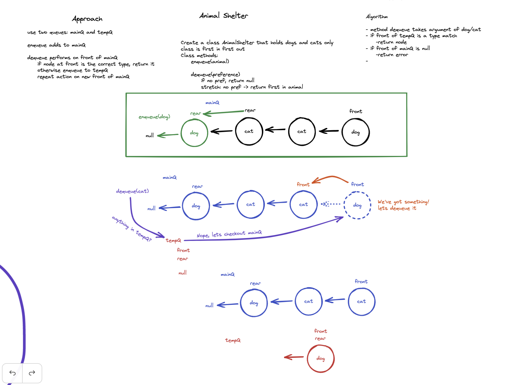

# Challenge Summary
First-in, First out Animal Shelter.

## Whiteboard Process
Unfinished whiteboard, timeboxed to thirty minutes. I used too many colors and it got away from me.

## Approach & Efficiency
I used two queues so I could keep it as FIFO as possible. Enqueue just feeds into the main queue. Dequeue first checks a secondary queue for a matching value and, if it's not found right at the front, then starts checking through the main queue. Enqueueing nonmatching values to the secondary queue along the way.

Enqueue is O(1) time and space
Dequeue is O(n) time and space, worst case you have to iterate through all nodes, making copies of each node along the way.

