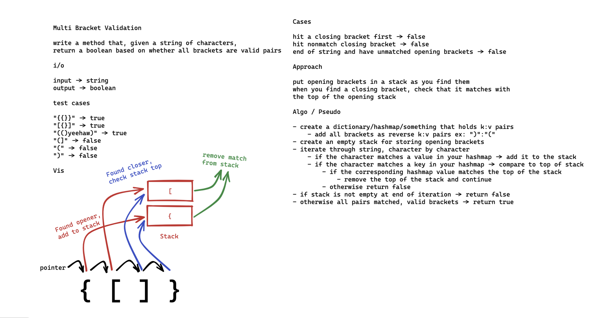

# Challenge Summary
Bracket Validation

## Whiteboard Process
Unfinished whiteboard, lots of moving parts so had great difficulty making an effective still image.

## Approach & Efficiency
Yet to be implemented. Here's my pseudo:

- create a dictionary/hashmap/something that holds k:v pairs
  - add all brackets as reverse k:v pairs ex: ")":"("
- create an empty stack for storing opening brackets
- iterate through string, character by character
  - if the character matches a value in your hashmap -> add it to the stack
  - if the character matches a key in your hashmap -> compare to top of stack
    - if the corresponding hashmap value matches the top of the stack
      - remove the top of the stack and continue
    - otherwise return false
- if stack is not empty at end of iteration -> return false
- otherwise all pairs matched, valid brackets -> return true

Time is O(n) as you have to check each string character.

Space is O(n) also unfortunately; worst case: the whole string is opening brackets and you copy them all...

