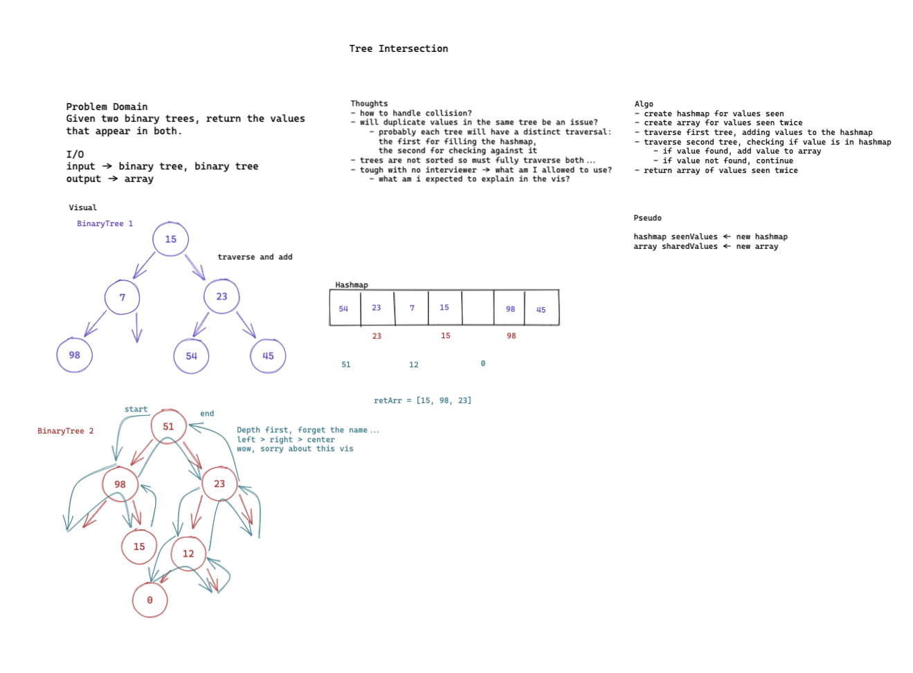

# Challenge
Given two binary trees, return the values they share. Utilize a hashmap.

### Approach

My plan was to traverse the first tree, adding values to the hashmap along the way. Then traverse the second tree, this time checking for values in the hashmap.

This one I definitely ran out time while timeboxing. I think my ideal solution would have involved a recursive method for each tree's traversal. The methods wouldn't have been too complicated, standard traversal with slightly different actions. But I only realized I would need new methods when I was already at code, so I ran out of time.

I do have a working solution, but not a pretty one.

### Whiteboard

