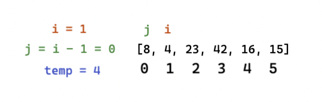

# Insert Sort

Insert sort is an array sorting method that uses two pointers. One to traverse through the array and another to traverse backwards from the front pointer to the beginning of the array, swapping values as necessary.

## Pseudo

```
  InsertionSort(int[] arr)

    FOR i = 1 to arr.length

      int j <-- i - 1
      int temp <-- arr[i]

      WHILE j >= 0 AND temp < arr[j]
        arr[j + 1] <-- arr[j]
        j <-- j - 1

      arr[j + 1] <-- temp
```

## Step-thru

Input array: `[8, 4, 23, 42, 16, 15]`



1. We begin our for loop and set `i` equal to 1. `i` will also represent the index of the value held by `temp` and `j` will start it's run just before `i`. We then enter the while loop and compare the value at `j` and the value of `temp`. In this case, `temp` is less than the value at `j` so we set the next value in the array to the value at `j`, then decrement `j`, then check again. For this first step of the sort, we don't have anywhere for `j` to go really, so we break out of the while loop and set the 0th index equal to `temp`

    

1. In this next step, `temp` is greater than the value at `j` so we never even enter the while loop, but we do still set the value at `j+1` even though this makes no change.

    

1. Same as above, these values were already in order.

    

1. Now things are getting spicy! Since `temp` is now most definitely less than the value at `j`, we enter the while loop and start swapping. As `j` works towards the front, it essentially shifts the value at it's index back one place `j+1` before decrimenting. This process continues until either: `j` gets to the front of the array or the value at `j` is less than `temp`. In this step, we break out of the while loop when `j` is at index 1. At that point the value at `j` is less than `temp` so then we stick `temp` right behind `j` at `j+1`.

    

1. And for the grand finale... we just do almost the exact same as the previous step. We enter the while loop, swapping values until we find one that is less than `temp`. Again, this occurs at index 1. Then we again set the value at `j+1` to `temp`. Because `i` is at the final index, we break out of the entire function after this step and now our array is sorted! Tahdah!

    

