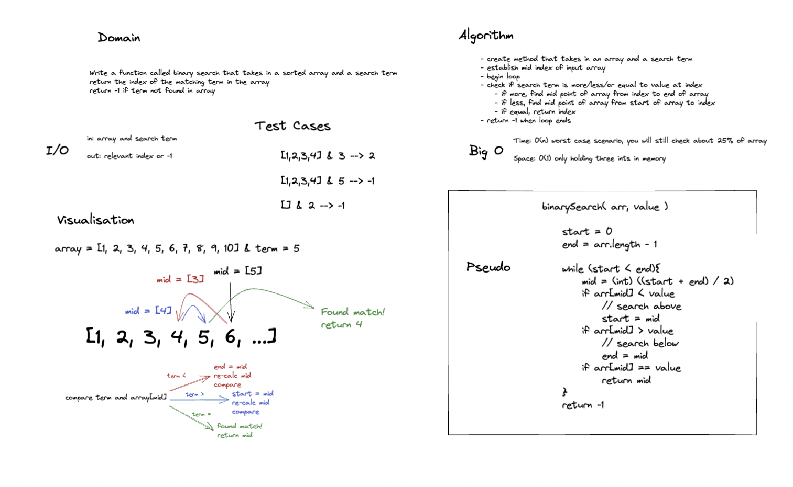

# Binary Search

Write a function called BinarySearch which takes in 2 parameters: a sorted array and the search key. Without utilizing any of the built-in methods available to your language, return the index of the array’s element that is equal to the value of the search key, or -1 if the element is not in the array.

## Whiteboard

## Approach and Big O

I'm pretty sure I implemented a standard binary search. The portion of the array that will be searched is essentially cut in half at each step until a match is found or determined as not present.

Time is O(n) technically like O(.25n) but that doesn't count.
Space is O(1) as the max variables help is three integers
